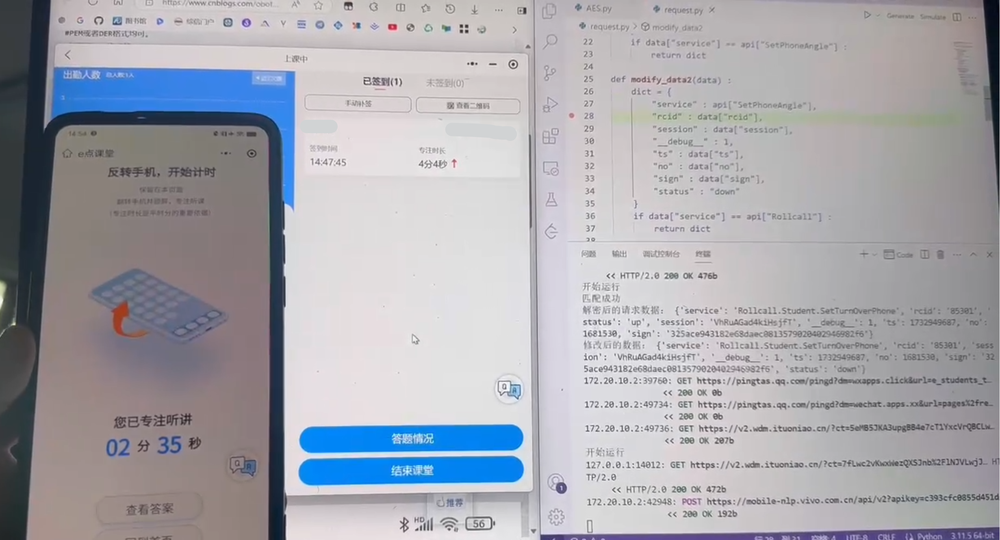

# 某点课堂 微信小程序 逆向实战
## 需求
上课时必须反转手机锁屏，才会开始计时，听课时间算入平均分，这严重妨碍了大学生上课摸鱼
## 食用
### 安装依赖
```
pip(3) install -r requirements.txt
```
### 配置mitmdump证书，以前安装过的不用
```
mitmdump
```
然后去所在用户文件夹找.mitmproxy文件夹

Windows直接双击mitmproxy-ca.p12，安装为用户信任证书

Android将mitmproxy-ca.pem重命名为.0文件后放入/system/etc/security/cacerts/内

iOS将mitmproxy-ca.pem作为附件发到邮箱，Safari打开邮箱中的附件
### 设置代理端口
设置代理端口为8080，然后运行
```
mitmdump -s request.py
```
## 分析
1.抓包发现API数据加密了，想要知道怎么加密解密，需要逆向

2.逆向微信小程序，得到JS代码，先静态分析，复制加密解密相关代码，并找到调用入口

工具：[KillWxapkg](https://github.com/Ackites/KillWxapkg)

3.修补环境，测试加密解密JS代码，然后用Python封装

扣取代码：aes.js aes-json-format.js crypto.js sha1.js

修补：main.js

封装：AES.py

4.动态调试，把逆向文件放入微信开发者工具，打断点，分析计时逻辑，发现通过角度变化判断是否计时
```
思路1.代理拦截屏幕角度请求 
思路2.模拟发送开始计时请求  
思路3.用户在开始计时后，手机倒扣角度（屏幕向下）。然后返回桌面并锁屏，之后即可计时，点亮屏幕之后不点小程序，否则会发送屏幕旋转请求停止计时
```
5.再次抓包，控制时间关键点，只抓计时停止和计时开始瞬间，得到计时相关请求
```json
发送up代表手机屏幕向上，终止计时
{"service":"Rollcall.Student.SetTurnOverPhone","rcid":"85290","status":"up","session":"lHJfaOLk2MyZ67aH","__debug__":1,"ts":1732898720,"no":1681514,"sign":"11de55afe7d1ff5172ab841021ca66d34eb19fd9"}

发送down代表手机屏幕扣下，开始计时
{"service":"Rollcall.Student.SetTurnOverPhone","rcid":"85296","status":"down","session":"VhRuAGad4kiHsjfT","__debug__":1,"ts":1732944221,"no":1681059,"sign":"f32a944aff842d465eb30a703fb7f771a4090482"}
```
6.直接重写篡改请求中的status为down，即可实现需求

request.py

7.写代码，测试，测试成功，只要不发up就永远计时（注意，学生端计时器不动，是因为本地角度判断代码生效，但是发给服务器的请求已经被篡改，可以看到教师端还在增加时间）




